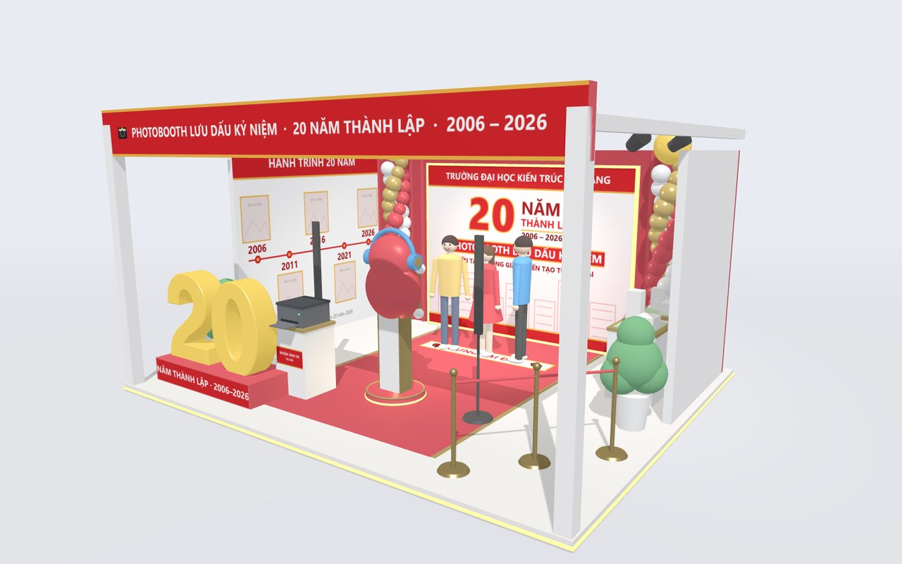
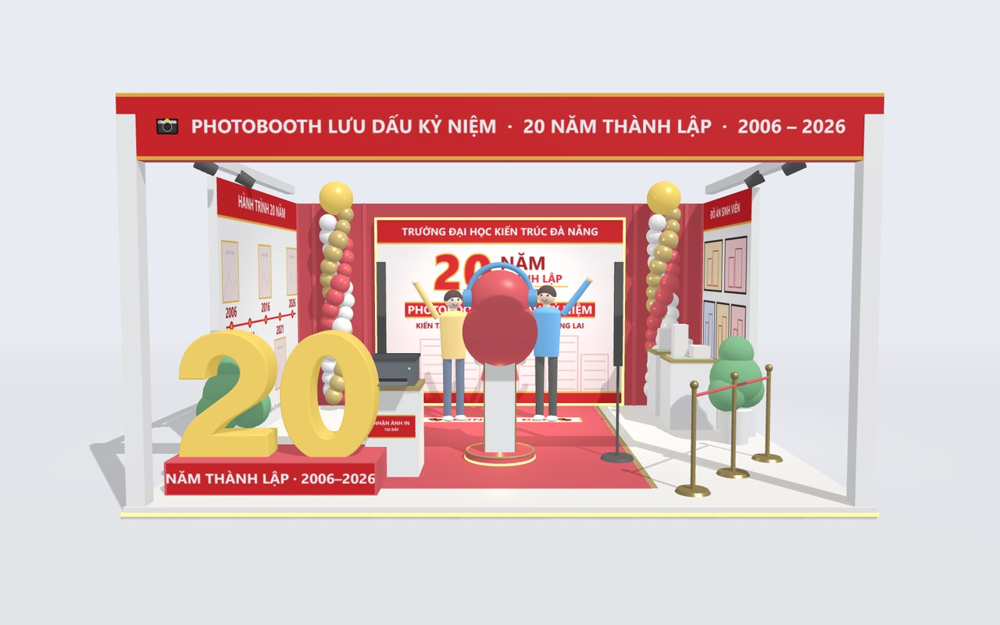
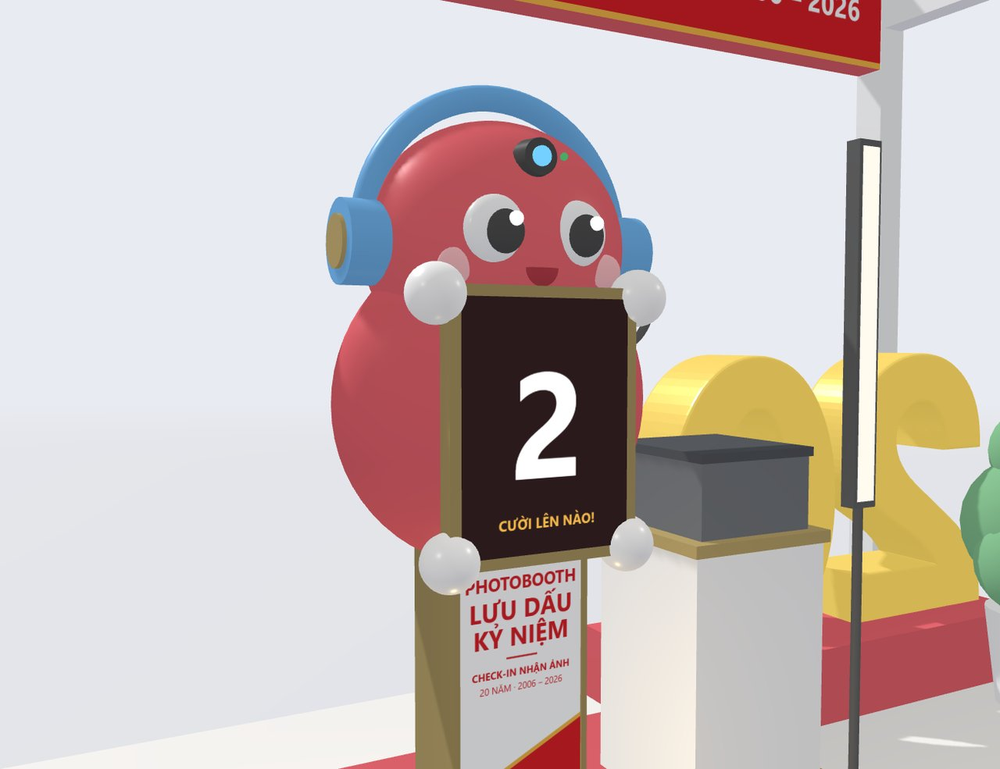
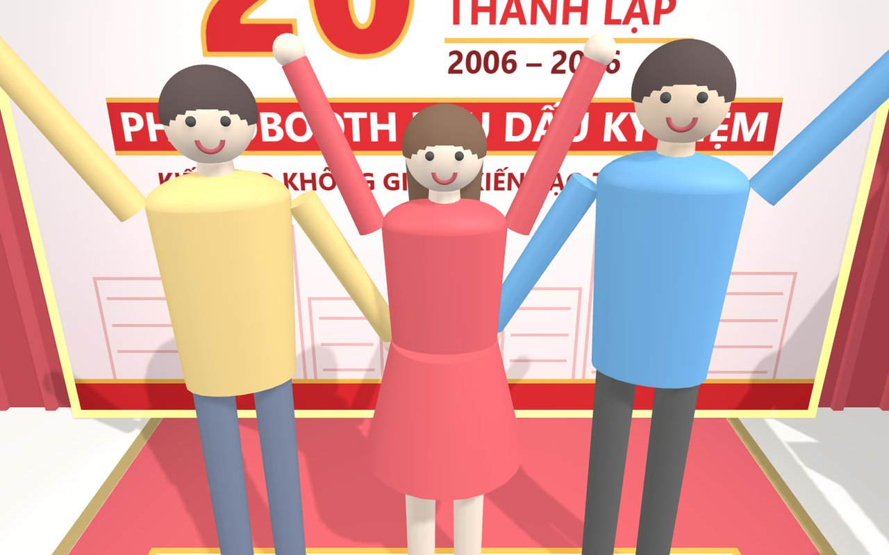
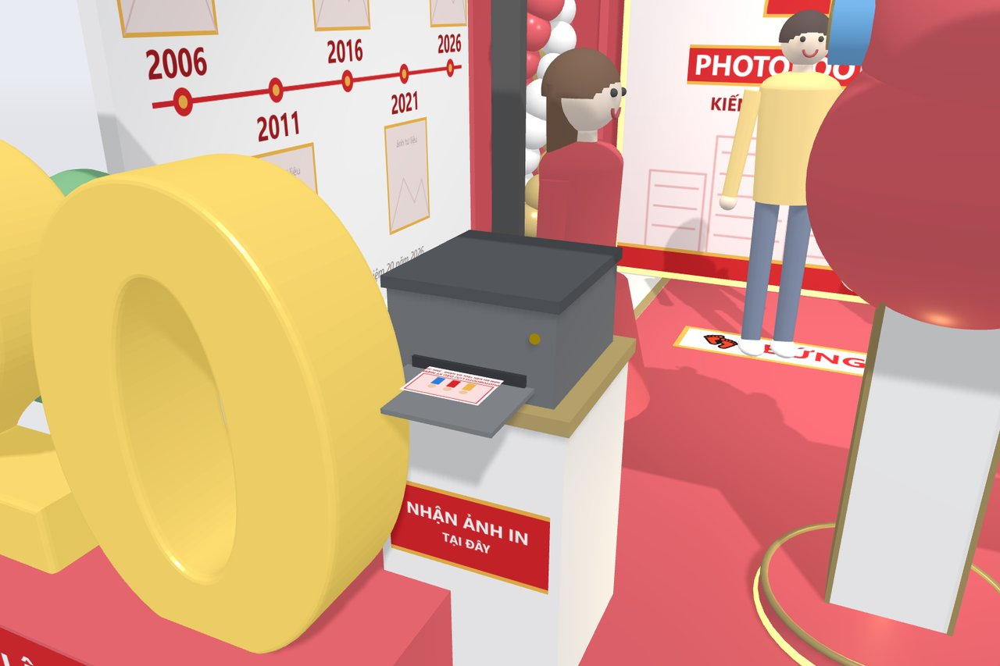
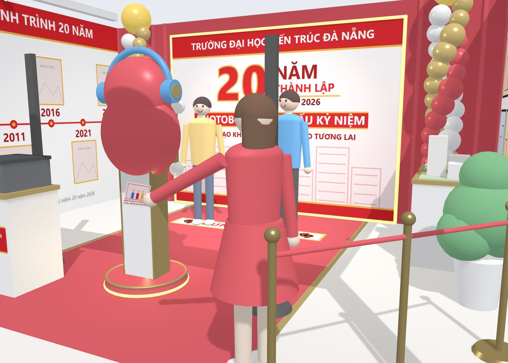
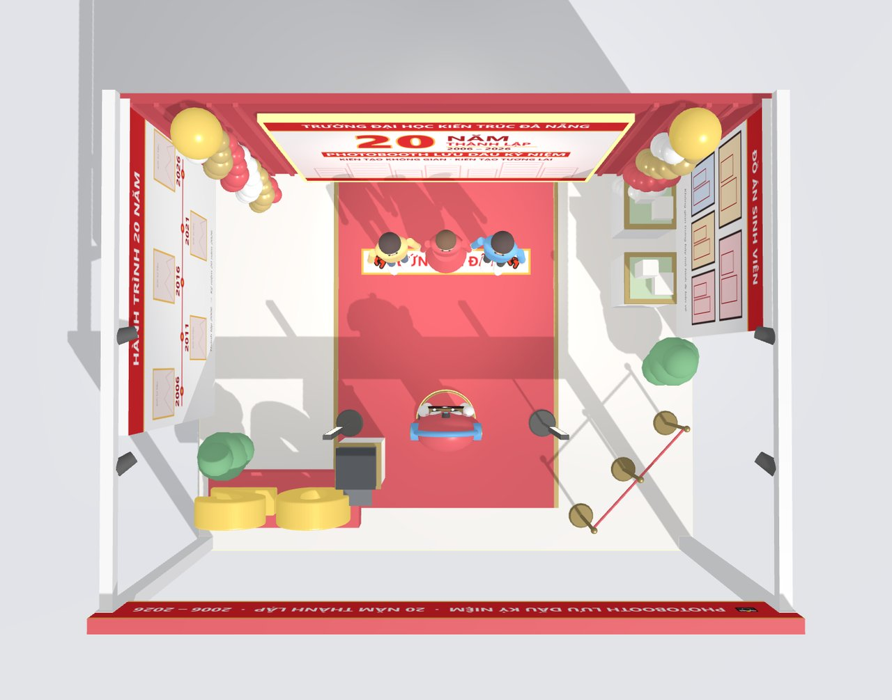

<div align="center">

# 📸 PHOTOBOOTH STUDIO

### Gian trưng bày 3D — Kỷ niệm 20 năm thành lập<br>Trường Đại học Kiến trúc Đà Nẵng

**2006 — 2026** · *Kiến tạo không gian · Kiến tạo tương lai*

<br>



<br>


</div>

---

## 📖 Giới thiệu

Mô phỏng 3D gian photobooth **"Lưu Dấu Kỷ Niệm"** phục vụ triển lãm kỷ niệm
**20 năm thành lập Trường Đại học Kiến trúc Đà Nẵng**.

Dự án dựng lại toàn bộ gian hàng và **diễn lại một lượt khách vào chụp ảnh**:
từ lúc chạm màn hình kiosk, lùi về vạch tạo dáng, đếm ngược, đèn flash sáng,
quét QR nhận ảnh, cho tới khi máy in nhả tờ ảnh kỷ niệm và khách cầm ra về.

> 🎯 **Mục đích:** trình bày ý tưởng cho ban tổ chức duyệt bố cục, kích thước
> và màu sắc **trước khi thi công thật**.

<br>

<table>
<tr>
<td width="25%" align="center"><h3>🏛️</h3><b>Gian 6 × 5 m</b><br><sub>Đủ backdrop, tường trưng bày, lối vào</sub></td>
<td width="25%" align="center"><h3>🤖</h3><b>Kiosk mascot</b><br><sub>Theo đúng thiết kế đã duyệt</sub></td>
<td width="25%" align="center"><h3>🖨️</h3><b>Máy in ảnh</b><br><sub>Nhả tờ ảnh 10 × 15 cm</sub></td>
<td width="25%" align="center"><h3>🎬</h3><b>Hoạt cảnh 6 bước</b><br><sub>Tự chạy, xem được cách vận hành</sub></td>
</tr>
</table>

---

## 🚀 Xem thử ngay

Mở trực tiếp bằng trình duyệt — **không cần cài đặt bất cứ thứ gì**.

| | Bản | File | Nội dung |
|:--:|---|---|---|
| ⭐ | **Bản chính** | [`gian-photobooth-20-nam-3d.html`](gian-photobooth-20-nam-3d.html) | Gian 3D đầy đủ: backdrop, tường trưng bày, máy in, hoạt cảnh 6 bước |
| | Rút gọn | [`mo-phong-photobooth-3d.html`](mo-phong-photobooth-3d.html) | Chỉ cảnh chụp 3D, chưa có gian hàng |
| | Sơ đồ | [`mo-phong-photobooth.html`](mo-phong-photobooth.html) | Bản vẽ 2D: mặt cắt ngang + mặt bằng bố trí |

> ⚠️ Lần mở đầu cần kết nối mạng để tải thư viện Three.js từ CDN.

**Muốn gửi link cho sếp mở trên điện thoại?** Bật GitHub Pages:
`Settings → Pages → Branch: main → / (root) → Save`
Khoảng 1 phút sau gian hàng chạy tại 👉 `https://niitbeo.github.io/photobooth-studio/`

---

## 🖼️ Hình ảnh

<table>
<tr>
<td width="50%"><br><div align="center"><b>Mặt tiền gian</b><br><sub>Bảng hiệu, cột bóng bay, số "20" 3D</sub></div></td>
<td width="50%"><br><div align="center"><b>Kiosk mascot</b><br><sub>Màn hình đang đếm ngược 3-2-1</sub></div></td>
</tr>
<tr>
<td width="50%"><br><div align="center"><b>Góc nhìn từ camera kiosk</b><br><sub>Đúng khung hình máy sẽ chụp được</sub></div></td>
<td width="50%"><br><div align="center"><b>Máy in nhả tờ ảnh</b><br><sub>Ảnh trườn ra khay, có khung 20 năm</sub></div></td>
</tr>
<tr>
<td width="50%"><br><div align="center"><b>Khách cầm ảnh ra về</b><br><sub>Bước cuối của một lượt chụp</sub></div></td>
<td width="50%"><br><div align="center"><b>Mặt bằng từ trên xuống</b><br><sub>Kiểm tra luồng di chuyển của khách</sub></div></td>
</tr>
</table>

---

## 🎬 Quy trình vận hành — 6 bước

Hoạt cảnh tự chạy lặp lại, mỗi vòng khoảng **22 giây**.

```
  ①          ②          ③          ④          ⑤          ⑥
CHẠM  ──▶  TẠO DÁNG ──▶  CHỤP  ──▶ QUÉT QR ──▶ IN ẢNH ──▶ RA VỀ
màn hình   3 · 2 · 1    📸 flash   📱 điện thoại  🖨️ 12 giây   🎟️ cầm ảnh
```

| Bước | Diễn biến | Màn hình kiosk |
|:--:|---|---|
| **1** | Khách chạm màn hình để bắt đầu, chọn khung ảnh | `CHẠM ĐỂ BẮT ĐẦU ♡` |
| **2** | Cả nhóm lùi về vạch "Đứng tại đây", tạo dáng | Đếm ngược `3 · 2 · 1` |
| **3** | Đèn flash sáng, máy chụp, khách xem lại ảnh | Ảnh vừa chụp + `Đẹp quá ✓` |
| **4** | Khách quét mã QR để nhận ảnh về điện thoại | Mã QR |
| **5** | Máy in nhả tờ ảnh ra khay (~12 giây/tấm) | `ĐANG IN ẢNH` + thanh tiến trình |
| **6** | Khách cầm tờ ảnh kỷ niệm ra về | Quay lại màn hình chờ |

---

## 🎮 Điều khiển

### Chuột

| Thao tác | Tác dụng |
|---|---|
| Kéo chuột | Xoay quanh gian hàng |
| Lăn chuột | Phóng to / thu nhỏ |
| Bấm ảnh mẫu góc trên phải | Phóng to ảnh kiosk thật để đối chiếu |

### Thanh nút phía dưới

| Nút | Tác dụng |
|---|---|
| **6 góc nhìn dựng sẵn** | Góc 3/4 · Mặt trước kiosk · Từ camera kiosk · Mặt tiền gian · Tường hành trình · Từ trên xuống |
| **Tạm dừng / Chạy tiếp** | Dừng hoạt cảnh để xem kỹ một khoảnh khắc |
| **Chạy lại** | Về bước 1 |
| **Ẩn giao diện** | Ẩn toàn bộ chữ và nút để chụp màn hình sạch — phím tắt `H` |
| **Ảnh mẫu** | Bật / tắt khung ảnh kiosk thật |
| **Vùng chụp** | Hiện hình nón thể hiện khung hình camera bắt được |
| **Kích thước** | Hiện các đường kích thước gian hàng |

### Thanh 5 bước phía trên

Bấm vào bước nào để **nhảy thẳng tới bước đó**, không phải chờ hết vòng.

---

## 📐 Thông số gian hàng

| Hạng mục | Kích thước đề xuất |
|---|---|
| **Kích thước gian** | 6,0 m × 5,0 m, cao 3,0 m |
| **Backdrop chụp ảnh** | 3,6 m × 2,7 m, viền LED |
| **Kiosk → vạch đứng chụp** | ≈ 2,0 m (2–4 người) · 2,5–3,0 m cho nhóm 5–6 người |
| **Người → backdrop** | ≈ 0,7 – 1,1 m *(tránh đổ bóng lên backdrop)* |
| **Camera trên đầu mascot** | cao ≈ 1,9 m, chúc xuống 3–5° |
| **Màn hình cảm ứng** | tâm màn hình cao ≈ 1,3 m |
| **Ánh sáng** | 2 đèn LED đứng hai bên kiosk + 4 đèn rọi trên xà |
| **Máy in ảnh** | Bục cao 0,85 m bên trái kiosk · khổ ảnh 10 × 15 cm |
| **Lối vào** | Bên phải, cọc dây chắn cho hàng chờ |

---

## 🗺️ Bố trí trong gian

```
                    ┌──────────── TƯỜNG SAU (lam đỏ) ────────────┐
   Tường trái       │        ┌──────────────────────┐            │   Tường phải
  HÀNH TRÌNH        │  🎈    │  BACKDROP 3,6 × 2,7  │    🎈      │  ĐỒ ÁN SINH VIÊN
    20 NĂM          │        └──────────────────────┘            │   + bục mô hình
 2006 → 2026        │             👤 👤 👤  ← vạch đứng          │
                    │                                            │
                    │   🖨 máy in      🤖 KIOSK      💡 đèn      │
                    │                                            │
   số "20" 3D       └──── BẢNG HIỆU MẶT TIỀN ─────  🚧 hàng chờ ─┘
```

---

## 📁 Cấu trúc thư mục

```
photobooth-studio/
├── index.html                      # Chuyển hướng sang bản chính
├── gian-photobooth-20-nam-3d.html  # ⭐ BẢN CHÍNH — gian 3D đầy đủ
├── mo-phong-photobooth-3d.html     # Bản 3D rút gọn, chỉ cảnh chụp
├── mo-phong-photobooth.html        # Bản 2D: mặt cắt + mặt bằng
├── assets/
│   └── kiosk-goc.png               # Ảnh thiết kế kiosk gốc (đã duyệt)
├── docs/                           # Ảnh chụp dùng cho README
└── README.md
```

> 💡 Mỗi file HTML là **một file độc lập**. Toàn bộ mô hình 3D, hình ảnh và
> hoạt cảnh đều nằm trong file — gửi cho ai họ mở cũng chạy được, không cần kèm thư mục.

---

## 🛠️ Công nghệ

| Thành phần | Mô tả |
|---|---|
| [Three.js](https://threejs.org/) r128 | Dựng cảnh 3D, đổ bóng, ánh sáng (tải từ CDN jsDelivr) |
| `OrbitControls` | Xoay / zoom bằng chuột |
| Hình khối cơ bản | Toàn bộ vật thể dựng bằng box, cylinder, sphere — **không dùng file model ngoài** |
| HTML Canvas | Chữ trên backdrop, bảng hiệu, màn hình kiosk, tờ ảnh in đều vẽ bằng Canvas rồi đắp lên vật thể |

> ✏️ Nhờ vậy, **sửa nội dung chữ chỉ cần sửa code, không cần phần mềm đồ hoạ.**

---

## 💻 Chạy tại máy

Mở thẳng file `.html` bằng trình duyệt là đủ. Nếu muốn chạy qua máy chủ cục bộ:

```bash
git clone https://github.com/niitbeo/photobooth-studio.git
cd photobooth-studio
python -m http.server 8765
```

Rồi mở `http://localhost:8765/`

---

## ⚠️ Cần xác nhận trước khi thi công

Các thông tin dưới đây là **ước lượng**, cần đối chiếu thực tế:

- [ ] **Năm thành lập 2006** — cần xác nhận lại với nhà trường
- [ ] **Kích thước gian 6 × 5 m** — cần đo theo mặt bằng thật của khu triển lãm
- [ ] **Khoảng cách kiosk → người 2,0 m** — phụ thuộc tiêu cự ống kính máy ảnh sẽ dùng
- [ ] **Thời gian in 12 giây/tấm** — theo máy in nhiệt phổ thông, cần kiểm tra theo máy thực tế
- [ ] **Ảnh tư liệu trên tường hành trình** — hiện là ô trống, chờ ảnh thật từ nhà trường

---

## 📝 Ghi chú

Mô hình 3D dựng bằng khối hình đơn giản, dùng để **duyệt bố cục, kích thước và màu sắc**.
Đây không phải bản render thật để in ấn.

Muốn có phối cảnh chân thực: chụp màn hình góc ưng ý *(bấm **Ẩn giao diện** trước khi chụp)*
rồi đưa vào công cụ tạo ảnh AI cùng ảnh kiosk gốc trong thư mục `assets/`.

---

<div align="center">

**Trường Đại học Kiến trúc Đà Nẵng**

*Kiến tạo không gian · Kiến tạo tương lai*

</div>
