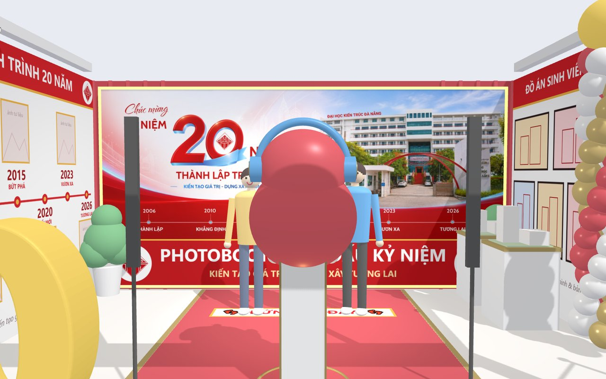
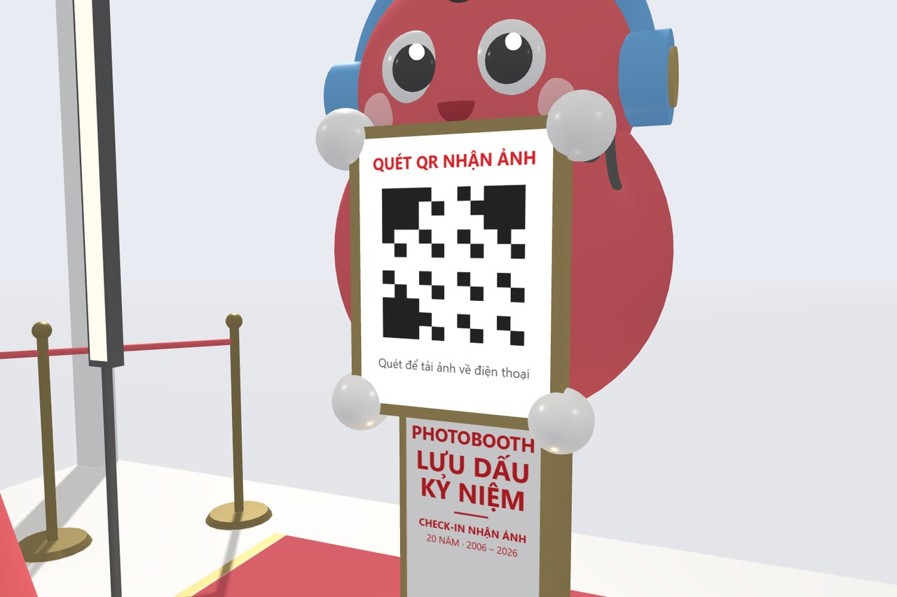
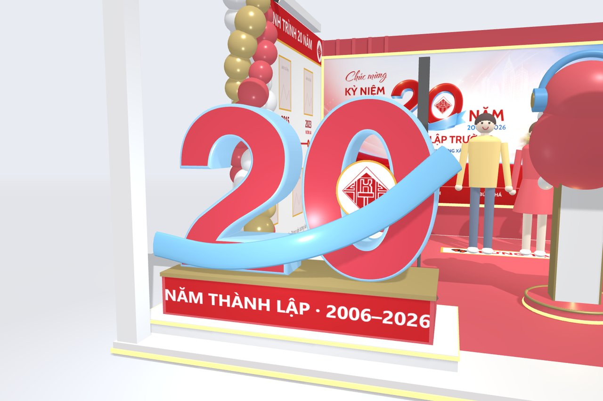

<div align="center">

# 📸 PHOTOBOOTH STUDIO

### Gian trưng bày 3D — Kỷ niệm 20 năm thành lập<br>Trường Đại học Kiến trúc Đà Nẵng

**2006 — 2026** · *Kiến tạo giá trị – Dựng xây tương lai*

<br>


<br>


</div>

---

## 📖 Giới thiệu

Mô phỏng 3D gian photobooth **"Lưu Dấu Kỷ Niệm"** phục vụ triển lãm kỷ niệm
**20 năm thành lập Trường Đại học Kiến trúc Đà Nẵng**.

Dự án dựng lại toàn bộ gian hàng và **diễn lại một lượt khách vào chụp ảnh**:
từ lúc chạm màn hình kiosk, lùi về vạch tạo dáng, đếm ngược, đèn flash sáng,
cho tới khi quét mã QR để **tải ảnh về điện thoại**.

> 📱 Photobooth này **không in ảnh**. Khách chụp xong quét QR và nhận ảnh số về máy.

> 🎯 **Mục đích:** trình bày ý tưởng cho ban tổ chức duyệt bố cục, kích thước
> và màu sắc **trước khi thi công thật**.

<br>

<table>
<tr>
<td width="25%" align="center"><h3>🏛️</h3><b>Gian 6 × 5 m</b><br><sub>Banner 20 năm và logo chính thức của trường</sub></td>
<td width="25%" align="center"><h3>🤖</h3><b>Kiosk mascot</b><br><sub>Theo đúng thiết kế đã duyệt</sub></td>
<td width="25%" align="center"><h3>📱</h3><b>Nhận ảnh qua QR</b><br><sub>Quét mã, tải ảnh về điện thoại</sub></td>
<td width="25%" align="center"><h3>🎬</h3><b>Hoạt cảnh 4 bước</b><br><sub>Tự chạy, xem được cách vận hành</sub></td>
</tr>
</table>

---

## 🚀 Xem thử ngay

Mở trực tiếp bằng trình duyệt — **không cần cài đặt bất cứ thứ gì**.

| | Bản | File | Nội dung |
|:--:|---|---|---|
| ⭐ | **Bản chính** | [`gian-photobooth-20-nam-3d.html`](gian-photobooth-20-nam-3d.html) | Gian 3D đầy đủ: backdrop banner 20 năm, tường trưng bày, hoạt cảnh 4 bước |
| | Rút gọn | [`mo-phong-photobooth-3d.html`](mo-phong-photobooth-3d.html) | Chỉ cảnh chụp 3D, chưa có gian hàng |
| | Sơ đồ | [`mo-phong-photobooth.html`](mo-phong-photobooth.html) | Bản vẽ 2D: mặt cắt ngang + mặt bằng bố trí |

> ⚠️ Lần mở đầu cần kết nối mạng để tải thư viện Three.js từ CDN.

**Xem online, mở được cả trên điện thoại** 👉 **https://niitbeo.github.io/photobooth-studio/**

---

## 🖼️ Hình ảnh

<table>
<tr>
<td width="50%"><br><div align="center"><b>Mặt tiền gian</b><br><sub>Bảng hiệu có logo trường, cột bóng bay, biểu tượng "20" 3D</sub></div></td>
<td width="50%"><br><div align="center"><b>Backdrop banner 20 năm</b><br><sub>Chỉ dùng banner chính thức, không chèn thêm chữ</sub></div></td>
</tr>
<tr>
<td width="50%"><br><div align="center"><b>Kiosk mascot</b><br><sub>Màn hình chờ "Chạm để bắt đầu" có logo trường</sub></div></td>
<td width="50%"><br><div align="center"><b>Mặt bằng từ trên xuống</b><br><sub>Kiểm tra luồng di chuyển của khách</sub></div></td>
</tr>
<tr>
<td width="50%"><br><div align="center"><b>Góc nhìn từ camera kiosk</b><br><sub>Đúng khung hình máy sẽ chụp được</sub></div></td>
<td width="50%"><br><div align="center"><b>Quét QR nhận ảnh</b><br><sub>Màn hình kiosk hiện mã QR để tải ảnh về điện thoại</sub></div></td>
</tr>
<tr>
<td width="50%" colspan="2" align="center"><br><b>Biểu tượng "20" check-in</b><br><sub>Dựng theo đúng banner: số đỏ viền xanh, ruy băng xanh, logo trường trong số 0, bệ 2 tầng có LED</sub></td>
</tr>
</table>

---

## 🎬 Quy trình vận hành — 4 bước

Hoạt cảnh tự chạy lặp lại, mỗi vòng khoảng **16 giây**.

```
   ①            ②            ③            ④
 CHẠM   ──▶   TẠO DÁNG  ──▶   CHỤP   ──▶  QUÉT QR
màn hình      3 · 2 · 1     📸 flash    📱 tải ảnh về máy
```

| Bước | Diễn biến | Màn hình kiosk |
|:--:|---|---|
| **1** | Khách chạm màn hình để bắt đầu, chọn khung ảnh | Logo trường + `CHẠM ĐỂ BẮT ĐẦU ♡` |
| **2** | Cả nhóm lùi về vạch "Đứng tại đây", tạo dáng | Đếm ngược `3 · 2 · 1` |
| **3** | Đèn flash sáng, máy chụp, khách xem lại ảnh | Ảnh vừa chụp + `Đẹp quá ✓` |
| **4** | Cả nhóm lại gần quét mã QR, tải ảnh về điện thoại | Mã QR `QUÉT QR NHẬN ẢNH` |

---

## 🎮 Điều khiển

### Chuột

| Thao tác | Tác dụng |
|---|---|
| Kéo chuột | Xoay quanh gian hàng |
| Lăn chuột | Phóng to / thu nhỏ |
| Bấm ảnh mẫu góc trên phải | Phóng to ảnh kiosk thật để đối chiếu |

### Thanh nút phía dưới

| Nút | Tác dụng |
|---|---|
| **6 góc nhìn dựng sẵn** | Góc 3/4 · Mặt trước kiosk · Từ camera kiosk · Mặt tiền gian · Tường hành trình · Từ trên xuống |
| **Tạm dừng / Chạy tiếp** | Dừng hoạt cảnh để xem kỹ một khoảnh khắc |
| **Chạy lại** | Về bước 1 |
| **Ẩn giao diện** | Ẩn toàn bộ chữ và nút để chụp màn hình sạch — phím tắt `H` |
| **Ảnh mẫu** | Bật / tắt khung ảnh kiosk thật |
| **Vùng chụp** | Hiện hình nón thể hiện khung hình camera bắt được |
| **Kích thước** | Hiện các đường kích thước gian hàng |

### Thanh 4 bước phía trên

Bấm vào bước nào để **nhảy thẳng tới bước đó**, không phải chờ hết vòng.

---

## 📐 Thông số gian hàng

| Hạng mục | Kích thước đề xuất |
|---|---|
| **Kích thước gian** | 6,0 m × 5,0 m, cao 3,0 m |
| **Backdrop chụp ảnh** | 5,9 m × 2,2 m, chỉ in banner 20 năm chính thức, viền LED |
| **Kiosk → vạch đứng chụp** | ≈ 2,0 m (2–4 người) · 2,5–3,0 m cho nhóm 5–6 người |
| **Người → backdrop** | ≈ 0,7 – 1,1 m *(tránh đổ bóng lên backdrop)* |
| **Camera trên đầu mascot** | cao ≈ 1,9 m, chúc xuống 3–5° |
| **Màn hình cảm ứng** | tâm màn hình cao ≈ 1,3 m |
| **Ánh sáng** | 2 đèn LED đứng hai bên kiosk + 4 đèn rọi trên xà |
| **Nhận ảnh** | Quét mã QR trên màn hình kiosk, ảnh số tải về điện thoại — không in |
| **Lối vào** | Bên phải, cọc dây chắn cho hàng chờ |

---

## 🗺️ Bố trí trong gian

```
                    ┌──────────── TƯỜNG SAU (lam đỏ) ────────────┐
   Tường trái       │  ┌──────────────────────────────────────┐  │   Tường phải
  HÀNH TRÌNH        │  │   BACKDROP BANNER 20 NĂM  5,9 × 2,2  │  │  ĐỒ ÁN SINH VIÊN
    20 NĂM          │  └──────────────────────────────────────┘  │   + bục mô hình
 2006 → 2026        │             👤 👤 👤  ← vạch đứng          │
                    │                                            │
                    │      💡 đèn      🤖 KIOSK      💡 đèn      │
                    │                                            │
   số "20" 3D       └──── BẢNG HIỆU MẶT TIỀN ─────  🚧 hàng chờ ─┘
```

---

## 📁 Cấu trúc thư mục

```
photobooth-studio/
├── index.html                      # Chuyển hướng sang bản chính
├── gian-photobooth-20-nam-3d.html  # ⭐ BẢN CHÍNH — gian 3D đầy đủ
├── mo-phong-photobooth-3d.html     # Bản 3D rút gọn, chỉ cảnh chụp
├── mo-phong-photobooth.html        # Bản 2D: mặt cắt + mặt bằng
├── assets/
│   ├── kiosk-goc.png               # Ảnh thiết kế kiosk gốc (đã duyệt)
│   ├── banner-20-nam.png           # Banner 20 năm chính thức (nguồn: dau.edu.vn)
│   └── logo-dau.png                # Logo trường (nguồn: dau.edu.vn)
├── docs/                           # Ảnh chụp dùng cho README
└── README.md
```

> 💡 Mỗi file HTML là **một file độc lập**. Toàn bộ mô hình 3D, hình ảnh và
> hoạt cảnh đều nằm trong file — gửi cho ai họ mở cũng chạy được, không cần kèm thư mục.

---

## 🛠️ Công nghệ

| Thành phần | Mô tả |
|---|---|
| [Three.js](https://threejs.org/) r128 | Dựng cảnh 3D, đổ bóng, ánh sáng (tải từ CDN jsDelivr) |
| `OrbitControls` | Xoay / zoom bằng chuột |
| Hình khối cơ bản | Toàn bộ vật thể dựng bằng box, cylinder, sphere — **không dùng file model ngoài** |
| HTML Canvas | Chữ trên backdrop, bảng hiệu, màn hình kiosk đều vẽ bằng Canvas rồi đắp lên vật thể |

> ✏️ Nhờ vậy, **sửa nội dung chữ chỉ cần sửa code, không cần phần mềm đồ hoạ.**

---

## 💻 Chạy tại máy

Mở thẳng file `.html` bằng trình duyệt là đủ. Nếu muốn chạy qua máy chủ cục bộ:

```bash
git clone https://github.com/niitbeo/photobooth-studio.git
cd photobooth-studio
python -m http.server 8765
```

Rồi mở `http://localhost:8765/`

---

## ⚠️ Cần xác nhận trước khi thi công

Các thông tin dưới đây là **ước lượng**, cần đối chiếu thực tế:

- [ ] **Kích thước gian 6 × 5 m** — cần đo theo mặt bằng thật của khu triển lãm
- [ ] **Khoảng cách kiosk → người 2,0 m** — phụ thuộc tiêu cự ống kính máy ảnh sẽ dùng
- [ ] **Đường truyền mạng tại gian** — quét QR tải ảnh cần wifi/4G ổn định
- [ ] **Ảnh tư liệu trên tường hành trình** — hiện là ô trống, chờ ảnh thật từ nhà trường

---

## 🎨 Nhận diện thương hiệu

Gian hàng dùng đúng bộ nhận diện kỷ niệm 20 năm của trường, lấy từ [dau.edu.vn](https://dau.edu.vn/):

| Thành phần | Vị trí trong gian |
|---|---|
| **Banner "Chúc mừng kỷ niệm 20 năm thành lập trường"** | In trên tường sau làm backdrop chụp ảnh, để nguyên bản, không chèn thêm chữ hay logo |
| **Logo trường** | Hai đầu bảng hiệu mặt tiền · màn hình chờ kiosk · tường hành trình |
| **6 mốc hành trình** | 2006 Thành lập · 2010 Khẳng định · 2015 Bứt phá · 2020 Đổi mới · 2023 Vươn xa · 2026 Tương lai |
| **Khẩu hiệu** | Kiến tạo giá trị – Dựng xây tương lai |

> Banner và logo là tài sản của Trường Đại học Kiến trúc Đà Nẵng, dùng ở đây cho mục đích trình bày phương án gian hàng của chính nhà trường.

---

## 📝 Ghi chú

Mô hình 3D dựng bằng khối hình đơn giản, dùng để **duyệt bố cục, kích thước và màu sắc**.
Đây không phải bản render thật để in ấn.

Muốn có phối cảnh chân thực: chụp màn hình góc ưng ý *(bấm **Ẩn giao diện** trước khi chụp)*
rồi đưa vào công cụ tạo ảnh AI cùng ảnh kiosk gốc trong thư mục `assets/`.

---

<div align="center">

**Trường Đại học Kiến trúc Đà Nẵng**

*Kiến tạo giá trị – Dựng xây tương lai*

</div>
